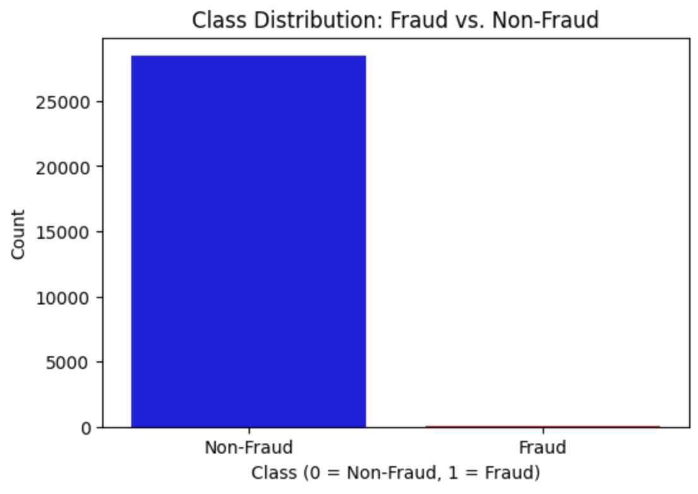
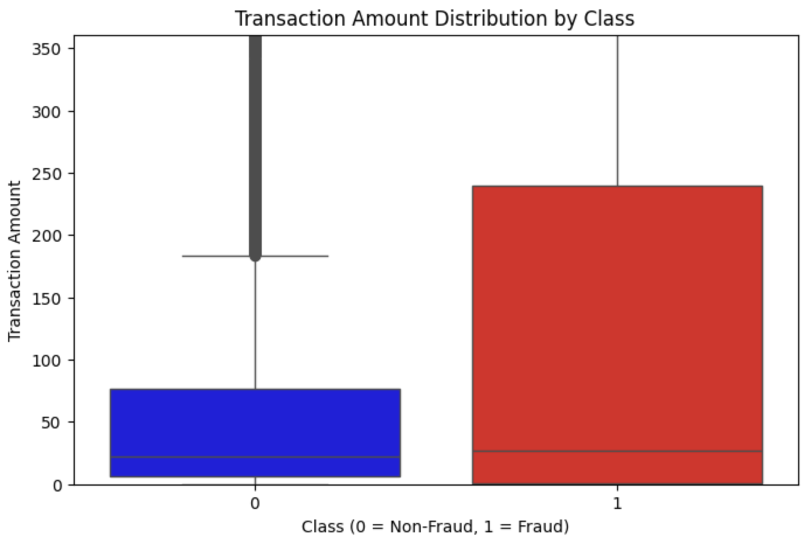
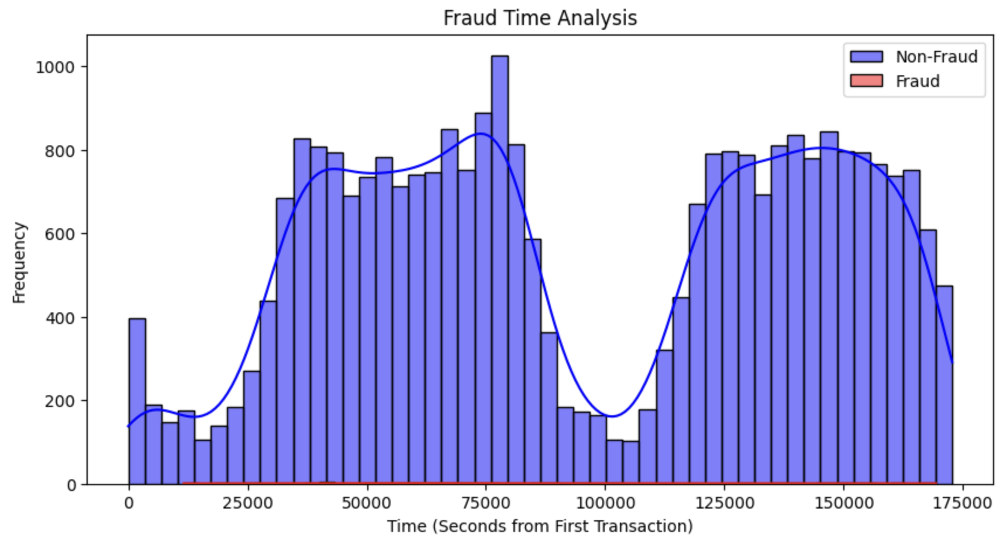

# **Credit Card Fraud Detection - Data Visualization**  

This project explores credit card fraud detection through **data visualization** using **Matplotlib and Seaborn**. The goal is to uncover insights into fraudulent transactions and their characteristics.  

## 📊 **Key Visualizations**  

### **1️⃣ Class Distribution: Fraud vs. Non-Fraud**  
Fraudulent transactions make up a **small fraction** of the dataset, but their impact is significant.  

📌 **Key Insights:**  
- Fraud cases are rare but can involve **high transaction amounts**.  
- Non-fraud transactions dominate, making fraud detection challenging.  

📷   

### **2️⃣ Transaction Amounts by Class**  
A box plot visualizes the spending behavior differences between fraudulent and non-fraudulent transactions.  

📌 **Key Insights:**  
- Fraudulent transactions show **higher variability** in amounts.  
- Non-fraud transactions tend to be **lower in value and more consistent**.  

### **3️⃣ Fraud Activity Over Time**  
Understanding when fraud occurs can help in building better fraud detection models.  

📌 **Key Insights:**  
- Fraud transactions often appear in **specific time windows**.  
- Non-fraud transactions are **more evenly distributed** throughout the day.  

  

